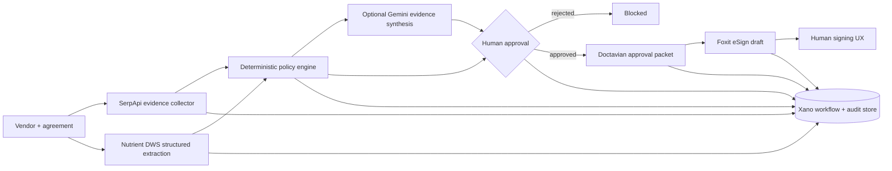

# TrustFlow architecture

## Safety invariant

No model, search result, extracted document field, or workflow automation is permitted to authorize a signature. The application requires an explicit reviewer approval **and** a second explicit human intent flag before it will even create a Foxit eSign draft. The Foxit adapter hardcodes `sendNow=false`, so TrustFlow itself never emails a signer or dispatches a contract.
